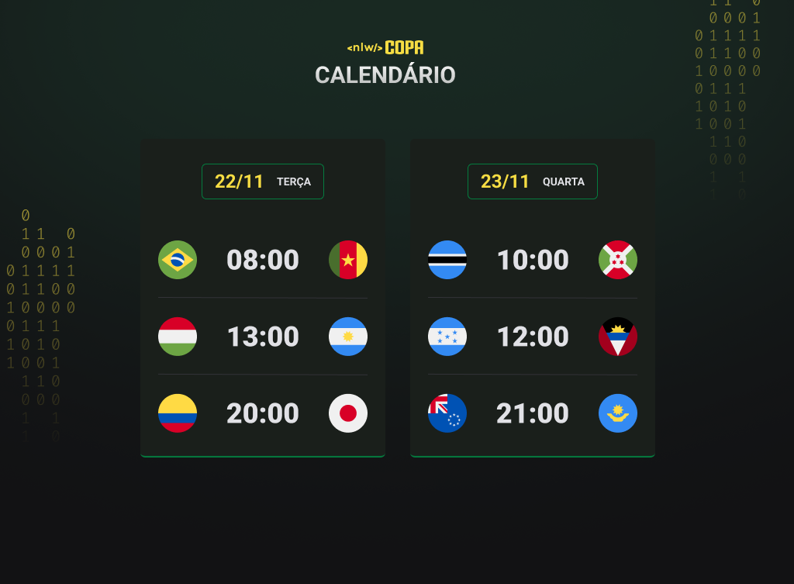

<h1 align="center"> NLW  #10 Copa </h1>

Evento exclusivo e gratuito, promovido pela Rocketseat para ensino de tecnologias WEB.

  <a href="#-tecnologias">Tecnologias</a>&nbsp;&nbsp;&nbsp;|&nbsp;&nbsp;&nbsp;
  <a href="#-projeto">Projeto</a>&nbsp;&nbsp;&nbsp;|&nbsp;&nbsp;&nbsp;
  <a href="#-layout">Layout</a>&nbsp;&nbsp;&nbsp;|&nbsp;&nbsp;&nbsp;
  <a href="#memo-licença">Licença</a>

  

 

  

## 🚀 Tecnologias

Esse projeto foi desenvolvido com as seguintes tecnologias:

- HTML e CSS
- JavaScript e JSON
- Git e Github

## 💻 Projeto

É um projeto que mostra os jogos da Copa 2022.

## 🔖 Layout

Você pode visualizar o layout do projeto através [DESSE LINK](https://www.figma.com/file/mnOobOzslPKjsxqjVQsyxI/Calend%C3%A1rio-de-Jogos-(Community)?node-id=172%3A179). O meu calendário pessoal está disponível nesse [link](https://jul1anaportela.github.io/nlw-copa)! Devo frisar que apenas consegui desenvolver graças aos professores da rocket, dá uma olhadinha lá! 

## :memo: Licença

Esse projeto está sob a licença MIT.
